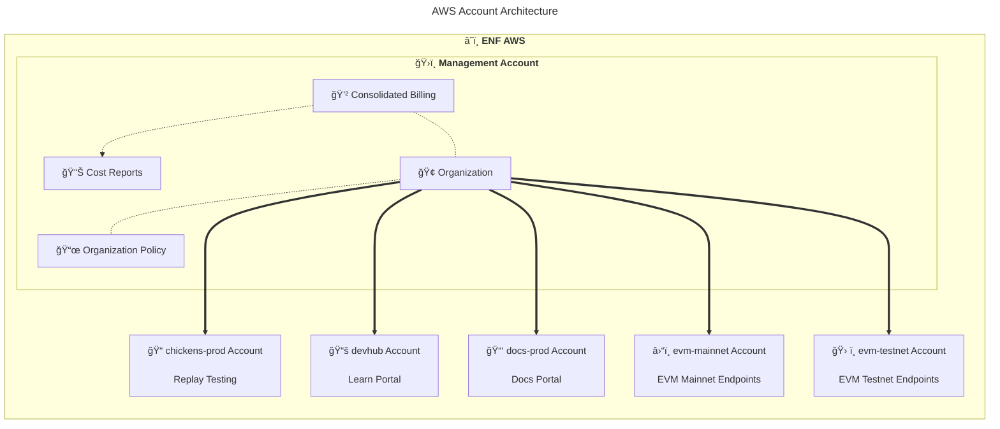
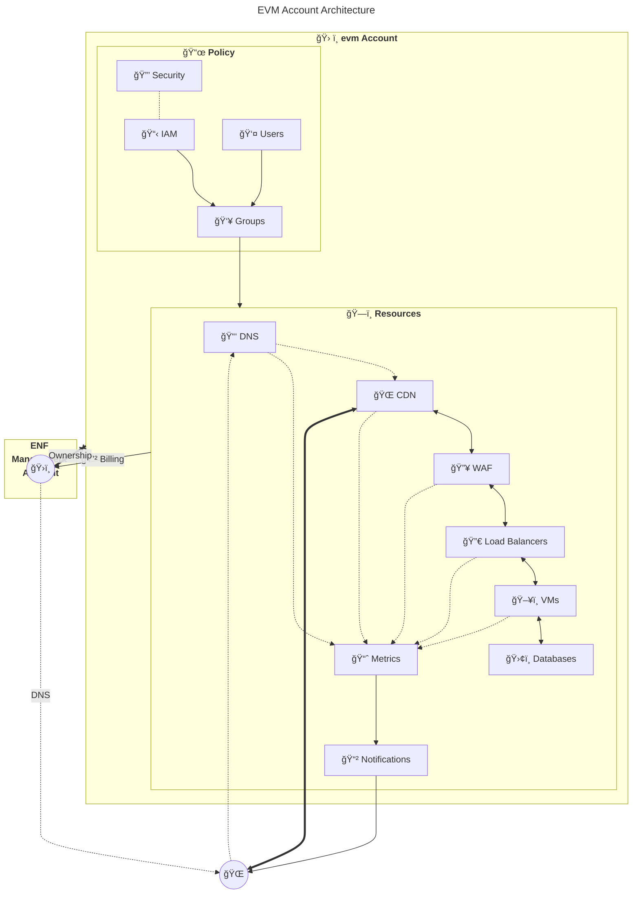

# AWS Account Migration
This document outlines the process to migrate an AWS account from one organization to another.

The EOS Network Foundation (ENF) Automation team had the foresight to create all cloud infrastructure in granular Amazon Web Services (AWS) accounts, one for each system or environment, making this process as straightforward as possible!

<!-- contents box begin -->
<table>
<tr/>
<tr>
<td width="225">

<b>Contents</b>

<!-- contents markdown begin -->

1. [Architecture](#architecture)
1. [Prerequisites](#prerequisites)
    1. [ENF](#enf)
    1. [EOS Labs](#eos-labs)
1. [Process](#process)
1. [Next Steps](#next-steps)
1. [See Also](#see-also)

<!-- contents markdown end -->

</td>
</tr>
</table>
<!-- contents box end -->

## Architecture
The existing ENF AWS account architecture looks like this.

Each child account is a "member" of the management account's "organization". The organization policy in the management account enforces consolidated billing, and prevents child accounts from leaving the organization.

Each EVM account looks like this.

You can see each account is isolated with its own security policy, IAM, users, groups, and resources. DNS is delegated using public DNS infrastructure, not Route53 IAM, so DNS will continue to work during and after a migration.

## Prerequisites
There are a few prerequisites to consider before migrating an AWS account.

### ENF
The EOS Network Foundation (ENF) will need to do the following.
1. Determine who will perform the migration, presumably the Automation team.
1. Grant that user permissions to remove accounts from the organization.
1. Remove email and SMS subscribers from the notification system in the accounts to be migrated, to protect their personal information.

### EOS Labs
EOS Labs will need to do the following.
1. Create an AWS account to serve as the management account, if they do not already have one.
    1. Setup billing.
    1. Create an AWS organization in that account.
    1. Ensure consolidated billing is on.
    1. Create an organization policy that prevents child accounts from leaving the organization (optional).
1. Obtain a credit card to attach to the child accounts during the migration.

> [!IMPORTANT]
> > AWS requires a credit card to be attached to an account to remove it from an organization.

## Process
Once the prerequisites are met, the migration process will look like this.

This process must be repeated for each account to be migrated.

The accounts will be migrated in this order:
1. Migrate a test account (optional).
1. Migrate `evm-testnet`.
1. Migrate `evm-mainnet`.

## Next Steps
Once all accounts have been migrated, stakeholders may wish to do the following.
1. Remove the credit card used for the migration from child account billing information.
1. Audit the IAM users with access to the child accounts.
1. Migrate DNS from `*.evm.eosnetwork.com` to `*.evm.eoslabs.io`.
1. Add new email and SMS notification subscribers to the child accounts.
1. Create a new [Telegram bot](https://lethanhan.medium.com/making-a-reminder-telegram-bot-with-aws-lambda-and-js-6a7b5d688250) controlled by EOS Labs, and remove the old one controlled by the ENF.

## See Also
Internal resources.
- [./Development Process](./README.md) ⤴
- [../Engineering](../README.md) ⤴⤴
- engineering [issue 84](https://github.com/eosnetworkfoundation/engineering/issues/84) - Organizational Migration of EVM Infrastructure
- EOS-EVM Documentation
    - [Cloud Architecture](https://github.com/eosnetworkfoundation/evm-public-docs/blob/main/cloud/README.md)
    - [eos-evm-internal](https://github.com/eosnetworkfoundation/eos-evm-internal) - internal-facing documentation of a [sensitive](https://github.com/eosnetworkfoundation/engineering/blob/main/standards/secrets.md) nature.
    - [Runbooks](https://github.com/eosnetworkfoundation/evm-public-docs/blob/main/runbooks/README.md)
- Notification System
    - [aws-cloudwatch-alarm-handler](https://github.com/eosnetworkfoundation/aws-cloudwatch-alarm-handler)
    - [telegram-bot](https://github.com/eosnetworkfoundation/telegram-bot)

External resources.
- AWS Documentation
    - [AWS re:Post guide](https://repost.aws/knowledge-center/organizations-move-accounts) - How do I move an account from an existing AWS Organization to another AWS Organization?
    - [Blog](https://aws.amazon.com/blogs/mt/aws-organizations-moving-an-organization-member-account-to-another-organization-part-1/) - AWS Organizations, moving an organization member account to another organization: Part 1
    - [Blog](https://aws.amazon.com/blogs/mt/migrating-accounts-between-aws-organizations-with-consolidated-billing-to-all-features/) - Migrating accounts between AWS Organizations with consolidated billing to all features
    - [Docs](https://docs.aws.amazon.com/prescriptive-guidance/latest/patterns/migrate-an-aws-member-account-from-aws-organizations-to-aws-control-tower.html) - Migrate an AWS member account from AWS Organizations to AWS Control Tower
    - GitHub [aws-account-migration-example](https://github.com/aws-samples/aws-account-migration-example)
- Medium
    - [Making a Reminder Telegram bot with AWS Lambda and JS](https://lethanhan.medium.com/making-a-reminder-telegram-bot-with-aws-lambda-and-js-6a7b5d688250)
    - [Things You Should Consider When Moving AWS Accounts Between AWS Organizations](https://aws.plainenglish.io/things-you-should-consider-when-moving-aws-accounts-between-aws-organizations-45a291715f)
- Reddit
    - [How do I 'Take Over' another company's AWS account that we have purchased?](https://old.reddit.com/r/aws/comments/boo8yu/how_do_i_take_over_another_companys_aws_account/)
    - [Two AWS organizations. What's the best way to move all the resources from one to another?](https://old.reddit.com/r/aws/comments/it5opb/two_aws_organizations_whats_the_best_way_to_move/)

***
> **_Legal Notice_**  
> This document was created in collaboration with a large language model, machine learning algorithm, or weak artificial intelligence (AI). This notice is required in some countries.
