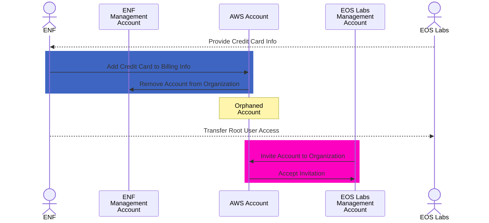

# AWS Account Migration
This document outlines the process to migrate an AWS account from one organization to another.

The EOS Network Foundation (ENF) Automation team had the foresight to create all cloud infrastructure in granular Amazon Web Services (AWS) accounts, one for each system or environment, making this process as straightforward as possible!

<!-- contents box begin -->
<table>
<tr/>
<tr>
<td width="225">

<b>Contents</b>

<!-- contents markdown begin -->

1. [Architecture](#architecture)
1. [Prerequisites](#prerequisites)
    1. [ENF](#enf)
    1. [EOS Labs](#eos-labs)
1. [Process](#process)
1. [See Also](#see-also)

<!-- contents markdown end -->

</td>
</tr>
</table>
<!-- contents box end -->

## Architecture
The existing ENF AWS account architecture looks like this.

```mermaid
---
title: AWS Account Architecture
---
flowchart LR
    subgraph enf["`☁️ **ENF AWS**`"]
        subgraph mgmt["`🏛️ **Management Account**`"]
            direction LR
            reports["📊 Cost Reports"]
            billing["💲 Consolidated Billing"]
            policy["📜 Organization Policy"]
            org["🏢 Organization"]

            billing -.-> reports
            billing -.- org
            org -.- policy
        end

        chickens["🐓 chickens-prod Account<br/><br/>Replay Testing"]
        devhub["📚 devhub Account<br/><br/>Learn Portal"]
        docs["📑 docs-prod Account<br/><br/>Docs Portal"]
        mainnet["⛓️ evm-mainnet Account<br/><br/>EVM Mainnet Endpoints"]
        testnet["🛠️ evm-testnet Account<br/><br/>EVM Testnet Endpoints"]
    end

    org ===> chickens
    org ===> devhub
    org ===> docs
    org ===> mainnet
    org ===> testnet
```

Each child account is a "member" of the management account's "organization". The organization policy in the management account enforces consolidated billing, and prevents child accounts from leaving the organization.

Each EVM account looks like this.

```mermaid
---
title: EVM Account Architecture
---
flowchart TB
    subgraph evm["`🛠️ **evm Account**`"]
        direction TB
        subgraph policy["`📜 **Policy**`"]
            direction TB
            security["🔒 Security"]
            iam["📋 IAM"]
            groups["👥 Groups"]
            users["👤 Users"]

            security -.- iam
            iam ---> groups
            users ---> groups
        end

        subgraph resources["`🏗️ **Resources**`"]
            direction LR
            dns["📑 DNS"]
            cdn["🌐 CDN"]
            waf["🔥 WAF"]
            lb["🔀 Load Balancers"]
            vm["🖥️ VMs"]
            db["🛢️ Databases"]
            metrics["📈 Metrics"]
            notifications["📲 Notifications"]

            dns -.-> cdn
            cdn <--> waf
            waf <--> lb
            lb <--> vm
            vm <--> db

            dns -.-> metrics
            cdn -.-> metrics
            waf -.-> metrics
            lb -.-> metrics
            vm -.-> metrics

            metrics ---> notifications
        end

        groups ---> resources
    end

    internet((🌐))

    subgraph org["`**ENF Management Account**`"]
        enf((🏛️))
    end

    internet -.-> dns
    internet <==> cdn
    internet ~~~ evm
    internet ~~~ iam

    notifications ---> internet

    enf -.-> |DNS| internet
    resources ---> |💲 Billing| enf
    enf ===x |Ownership| evm
```

You can see each account is isolated with its own security policy, IAM users, groups, and resources. DNS is delegated using public DNS infrastructure, not Route53 IAM, so DNS will continue to work during and after a migration.

## Prerequisites
There are a few prerequisites to consider before migrating an AWS account.

### ENF
The EOS Network Foundation (ENF) will need to do the following.
1. Determine who will perform the migration, presumably the Automation team.
1. Grant that user permissions to remove accounts from the organization.

### EOS Labs
EOS Labs will need to do the following.
1. Create an AWS account to serve as the management account, if they do not already have one.
    1. Setup billing.
    1. Create an AWS organization in that account.
    1. Create an organization policy that prevents child accounts from leaving the organization (optional).
1. Obtain a credit card to attach to the child accounts during the migration.
    - AWS requires a credit card to be attached to an account to remove it from an organization.

## Process
Once the prerequisites are met, the migration process will look like this.

This process must be repeated for each account to be migrated.

## See Also
More resources.
- [./Development Process](./README.md) ⤴
- [../Engineering](../README.md) ⤴⤴
- EOS-EVM Documentation
    - [Cloud Architecture](https://github.com/eosnetworkfoundation/evm-public-docs/blob/main/cloud/README.md)
    - [eos-evm-internal](https://github.com/eosnetworkfoundation/eos-evm-internal) - internal-facing documentation of a [sensitive](https://github.com/eosnetworkfoundation/engineering/blob/main/standards/secrets.md) nature.
    - [Runbooks](https://github.com/eosnetworkfoundation/evm-public-docs/blob/main/runbooks/README.md)

***
> **_Legal Notice_**  
> This document was created in collaboration with a large language model, machine learning algorithm, or weak artificial intelligence (AI). This notice is required in some countries.
