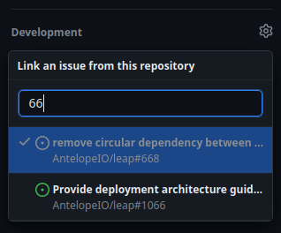

# Linking pull requests to issues

This document captures the process to follow when creating new pull requests (PRs) to ensure they are properly linked to their corresponding issues.

This process serves two purposes.

First, the team tracks issues rather than pull requests in the GitHub Projects. By linking PRs to issues, it is easy to discover the related PR of an issue in either the Projects UI or through the opened GitHub issue. The alternative requires scanning through the history of comments and references to find the one PR that is actually meant to resolve the issue and ignore the remaining noise.

Second, by linking the PR to the issue, when the PR is merged into the `main` branch it will automatically close the issue as completed. Taking advantage of this automated process prevents issues the team has routinely observed in which issues erroneously remain open for some time after the work has actually been completed because the developer working the issue forgot to carry out the additional manual step of closing the issue after they merged in their final PR.

## When to link PRs to issues

The process we follow to prepare releases captures all PRs that made it into the branch, not just ones that had issues assigned to a milestone. So code changes introduced with a PR that has no associated issues should not be missed. And it can sometimes be reasonable for small changes to be introduced through a PR without the additional overhead of first introducing an issue.

However, the vast majority of work that the team will spend time should be work that is planned and tracked through GitHub issues prior to anyone starting to actually implement the solution for the issue. So nearly all PRs are expected to have some issue that they are resolving. All of such PRs should ensure the PR is linked to the issue they are resolving.

Additionally, some PRs are not introducing any new code or changes to fix a particular issue; rather they are merely moving code that was already merged into an earlier release branch forward to later branches, e.g. to the `main` branch. These can be referred to as "forwarding PRs" as a shorthand. Forwarding PRs should also be linked to the issues associated with the code changes that they are forwarding. Typically, if the forwarding process is followed in a timely manner, the forwarding PR should only be forwarding code changes associated with one issue (the issue being worked by the developer authoring the forwarding PR). But sometimes when the forwarding process does not go very smoothly, the forwarding PR may be carrying with it prior commits in the release branch that were authored by others and had not yet been forwarded to later branches. In such cases, the PR should update its title and description to reflect that it is forwarding those other changes as well, and it should ensure the associated issues are also linked to the PR.

Ensuring the appropriate issues are linked to the forwarding PRs is valuable for the two purposes that were described earlier. Regarding the first purpose, it makes it easy for someone to verify that the changes related to an issue were integrated into the code base appropriate and were brought forward to all the appropriate branches up to and including the `main` branch. Regarding the second purpose, it ensures that the final PR that forwards the code changes into the `main` branch will automatically close the linked issue(s). (Note that merging a PR linked to an issue into a branch other than `main` will not automatically close the linked issue.)

## How to link PRs to issues

The most reliable way to link a PR to an issue is to do so using the development panel which is located on the right side bar of the pull request page.

The panel displays the current status of issues linked to the PR and allows you to modify it. It also allows you to type in the number of the issue to filter down and find the one you want to link to.

Using the development panel is a method that will work whether this is a PR targeting the `main` branch or a PR targeting a release branch.

However, there are other methods available on GitHub that may be a more convenient method of establishing the link.

If description of a PR targeting the `main` branch includes `resolves #???` where the `???` is replaced with the issue number the author intends to link to, then GitHub will automatically establish the linkage. This can be verified by looking for the linkage in the development panel. Note that this does not work for PRs that are not targeting the `main` branch, so you will have to resort to manually establish the linkage using the development in such cases.

Despite the lack of automatic linkage, there is no harm in including the `resolves #???` pattern in the descriptions of PRs that are targeting release branches and in fact it is encouraged behavior. Additionally, if you follow the pattern of copying the description of the PR into the forwarding PRs that move the changes into later branches, then the `resolves #???` trigger will eventually be captured in the PR that brings those changes into the `main` branch which saves the effort of having to manually establish the linkage via the development panel for that final PR.

Regardless of whether you regularly use the `resolves #???` pattern or choose to consistently establish linkages via the development panel, you should always verify the linkage you expect has been established after you create the PR by ensuring the linkage is present within the development panel.
