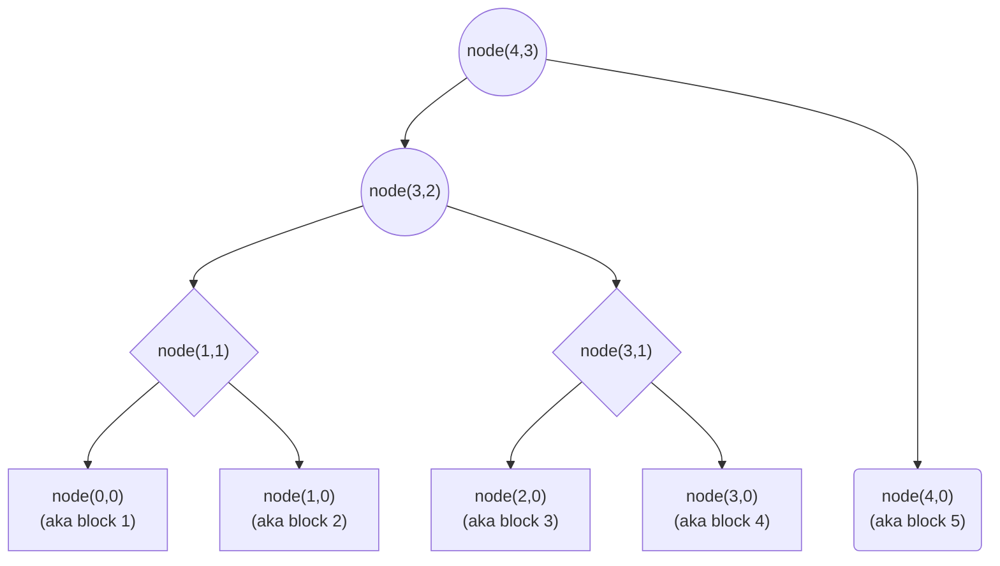
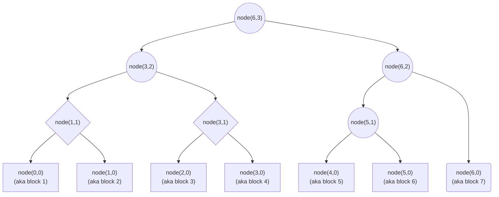
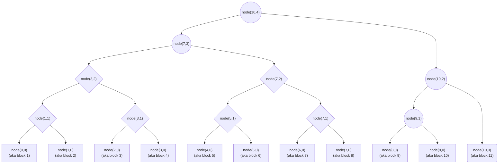

# Merkle Trees

## Referencing Merkle tree nodes

The nodes of the Merkle tree over an append-only sequence of leaf nodes can be referenced in a systematic way using the notation `node(max_ordinal, level)`, or just $\textrm{node}(m, l)$ for short with $m, l \in \mathbb{N}$. The argument `level`, or $l$, within the node reference captures the level of the referenced node within the tree; $l = 0$ used for leaf nodes and parent nodes have higher values of $l$. In references to leaf nodes specifically, `max_ordinal`, or $m$, represents the ordinal (counting from zero) of the leaf node within the sequence of leaf nodes appended to the Merkle tree. More generally, the `max_ordinal`, or $m$, of a node reference captures the maximum value of the set of ordinals of lead nodes reachable within the tree (either directly as children or indirectly as descendants) from a root node referred to by the node reference. Note that in a Merkle tree, each node contain a cryptographic digest which cryptographically commits to all digests in descendant nodes.

Define the set of valid node references $\mathcal{N} = \left\{ (m, l) \in \mathbb{N} \times \mathbb{N} \mid S((m, l)) \lor U((m, l)) \right\}$ where predicates $S(r)$ and $U(r)$ are defined for all $r \in \mathbb{N} \times \mathbb{N}$ as follows:

* $S(r = (m, l))$ denotes $\exists k \in \mathbb{N} : m + 1 = k \cdot 2^l$. $S(r)$ is referred to as the stable node predicate.
* $U(r = (m, l))$ denotes $\left\lfloor m \cdot 2^{(1 - l)} \right\rfloor$ is odd. $U(r)$ is referred to as the unstable node predicate.

If node reference $r$ satisfies neither the stable node predicate nor the stable node predicate, then $r \notin \mathcal{N}$ and $r$ is considered to not be a valid reference to a node. If a valid node reference $r \in \mathcal{N}$ satisfies the stable node predicate, i.e. $S(r)$, then we can say that $r$ refers to a stable node in a Merkle tree. If a valid node reference $r \in \mathcal{N}$ does not satisfy the stable node predicate but does satisfy the unstable node predicate, i.e. $U(r) \land \neg S(r)$, then we can say that $r$ refers to an unstable node in a Merkle tree.

While appending leaf nodes to a Merkle tree, new nodes beyond the appended leaf nodes will necessarily appear. In addition, some (but not all) prior nodes may need to disappear. In this context, the identity of the node is not based just on its reference values but also by the cryptographic digest contained within. If we consider a particular sequence of a monotonically growing list of leaf nodes, each forming distinct Merkle trees at each point along the sequence, a question arises regarding which of the inner (non-leaf) nodes at a prior point in the sequence survive to later points in the sequence. 

An unstable node will exist in exactly one point in the sequence which is of course to point where it comes into existence. In the next step in the sequence (after appending a new leaf node), the unstable node will disappear and then never be needed again in later Merkle trees.

A stable node comes into existence at some point in the sequence but then indefinitely remains part of the growing Merkle tree as the sequence continues. However, an optimization can allow most of the nodes of a growing Merkle tree to be discarded and still permit expanding the Merkle tree as new leaf nodes are appended. In fact, only a number of nodes approximately equal to the base-2 log of the number of leaf nodes in the full Merkle tree are actually needed at any point in the sequence in order to be able to continue making progress in the sequence.

With the referencing scheme described above, nodes in a Merkle tree over an append-only sequence of leaf nodes are immutably referenced by $r \in \mathcal{N}$. This means that in the context of a particular sequence of a monotonically growing list of leaf nodes, we can say that the node referenced by, for example, `node(3,2)` within the Merkle tree generated at the point in the sequence that appended the 4th leaf node aka `node(3,0)`, is the exact same node (including the cryptographic digest within) as the one also referenced by `node(3,2)` in other Merkle trees generated at later points in the sequence.

### Examples of Merkle trees over blocks

Note for the diagrams below: 

* Leaf nodes are in boxes.
* The latest added leaf node that generated the shown Merkle tree is given a slightly different decoration of a rounded box. The latest added leaf node should be stored explicitly because: in half of the cases, it is needed to support advancing to the next Merkle tree if a new leaf node were to be appended; and, it is useful information to keep accessible for other purposes.
* Inner nodes that do not need to be kept around to support advancing to the next Merkle tree are in rhombuses.
* Inner nodes that are in circles are recommended to be explicitly stored. However, only the inner nodes that are circles and also do not have any circle nodes as children must be explicitly stored to support advancing to the next Merkle tree.

#### Merkle tree over 5 blocks:


<br/>

Note: The root node, referenced by `node(4,3)`, is technically redundant to store since it could always be calculated on demand using nodes `node(3,2)` and `node(4,0)` which both must be stored. However, it is desirable to store it regardless because other algorithms may need to quickly reference the cryptographic digest within `node(4,3)` and it is not worth recomputing it each time.

#### Merkle tree over 7 blocks:


<br/>

Note: The nodes `node(6,3)` and `node(6,2)` are technically redundant to store since they could always be calculated on demand using nodes `node(3,2)`, `node(5,1)`, and `node(6,0)` which all must be stored. However, it is desirable to store nodes `node(6,3)` and `node(6,2)` regardless because other algorithms may need to quickly reference the cryptographic digests within `node(6,3)` or `node(6,2)` and it is not worth recomputing it each time.

#### Merkle tree over 11 blocks:


<br/>

Note: The nodes `node(10,4)` and `node(10,2)` are technically redundant to store since they could always be calculated on demand using nodes `node(7,3)`, `node(9,1)`, and `node(10,0)` which all must be stored. However, it is desirable to store nodes `node(10,4)` and `node(10,2)` regardless because other algorithms may need to quickly reference the cryptographic digests within `node(10,4)` or `node(10,2)` and it is not worth recomputing it each time.

#### Additional comments on examples

Notice that nodes that share the same node reference between the two example trees above are exactly the same node (meaning they have the same cryptographic digest). 

In addition, there are some nodes (unstable nodes) in one tree that do not survive into later trees in the sequence. For example, the first example tree contains `node(4,3)`, which is an unstable node, but it is not contained in the second example tree; in fact, it would immediately disappear in the next tree in the full sequence of Merkle trees generated by appending a new leaf node (the one with root `node(5,3)`) as would all unstable nodes. As an additional example, the second example tree contains `node(6,2)` and `node(6,3)` which are both unstable nodes and so they do not exist in the third example tree.

Finally, notice how `node(3,2)` exists in multiple trees (e.g. the first two example trees) in the sequence in a form that requires it to be explicitly stored, but eventually a tree later in the sequence (e.g. the third example tree) no longer requires it to be explicitly stored. This raises an interesting question of what is the "minimal lifetime" (i.e. the points within the sequence where the node should be explicitly stored) for any given node. It should already be clear that the minimal lifetime of an unstable node is exactly one point in the sequence (the point at which it is first introduced). The more interesting question is regarding the minimal lifetime of a stable node.

For example, `node(3,2)` was actually first introduced in the tree with root `node(3,2)`. And it first no longer needs to be stored in the tree with root `node(7,3)`, which also implies that it does not need to be stored in trees that have a root reference with a `max_ordinal` greater than 7 as well. If we look at the intermediate trees within the sequence of trees starting from the one with root at `node(3,2)` to the one with root at `node(7,3)`, we will find that `node(3,2)` should also be explicitly stored within the trees that have roots `node(4,3)`, `node(5,3)`, and `node(6,3)` .

In turns out that generally the minimal lifetime of any node is a contiguous range of points in the sequence of increasingly larger Merkle trees. Simply identifying the point at which the target node is first introduced (the `start` node reference of its minimal lifetime) and identifying the node reference with the largest `max_ordinal` identifying a root node of a tree in which the target node should still be explicitly stored (the `end` node reference of its minimal lifetime) immediately identifies the full set of trees in which the target node should be explicitly stored. A tree containing the target node which has a root identified by a valid node reference in which its `max_ordinal` value is (inclusively) between the `max_ordinal` values of the `start` and `end` node references of the "minimal lifetime" of the target node reference is a tree that should explicitly store the target node; any other tree that does not meet that condition does not need to explicitly store the target node.

It is straightforward to calculate this minimal lifetime just given the target node reference. The algorithm for this is captured in the `roots_containing_node` function (see Appendix A for Python source).

We can use that function to verify the above minimal lifetime analysis for the example of `node(3,2)` as the target node:

```python
pprint(roots_containing_node(NodeReference(3, 2)))
```

The above Python code generates the following output:

```python
NodeReferenceRange(start=NodeReference(max_ordinal=3, level=2), end=NodeReference(max_ordinal=6, level=3))
```

Notice how though the start reference of the minimal lifetime of `node(3,2)` starts at a level of 2, the end reference of that minimal lifetime is `node(6,3)` which has a level of 3. As the `max_ordinal` increases, the `level` may also have to increase. The node reference `node(6,2)` is a valid reference (in fact you can see `node(6,2)` in the second example tree above), but it would not be the correct end reference of the minimal lifetime of target node `node(3,2)` because `node(3,2)` is not contained in the sub-tree that has `node(6,2)` as its root. The only tree with a root reference that has a `max_ordinal` value of 6 is the one with a root reference of `node(6,3)`.

### Meaning behind binary encoding of ordinal numbers

The leaf node ordinal number encoded in binary reveals information about how the node is located within the structure of the Merkle tree.

For example, consider the example above of a Merkle tree over 11 blocks. The last leaf node in that Merkle tree is the one with ordinal number 10 (which in binary is 0b1010).

Now in the context of that example, consider some other leaf node such as the one for block 7, i.e. `node(6,0)`, which has ordinal number 6 (or 0b0110). 

The bits of the ordinal number are read from the most significant bit to the least significant bit and must include a sufficient number of 0 bits as padding to ensure it has the same bit length as the ordinal number of the leaf node with the greatest ordinal number in the Merkle tree. Reading the bits in this manner for `node(6,0)` gives the sequence: 0, 1, 1, 0. To find this node in the tree, first start at the root node and at the first bit in the bit sequence, and then repeat the following while there are bits left in the bit sequence: follow either the first child (if the current bit in the bit sequence is 0) or the second child (if the current bit in the bit sequence is 1); then, advance as many bits in the bit sequence as the gap in levels between the parent and child that was followed. This procedure leads to `node(6,0)`, however, this same procedure would also work to find any other leaf node in the tree.

The above procedure can be further generalized to identify any node in the tree, not just leaf nodes. The above procedure is followed using the bit sequence derived from the max_ordinal argument of the node reference but with a slight modification to stop the traversal once it reaches the level defined by the level argument of the node reference. The algorithm to traverse the tree to an arbitrary node within the tree specified using the node reference introduced earlier is provided below (Algorithm 1). See Appendix A for the full Python source code which defines the referenced data structures and functions, but also provides a modified version of the `traverse_tree` function called `traverse_hypothetical_tree` which has more functionality including calling a caller-specified reducer function in order of traversal with both the node visited and its sibling node.

**Algorithm 1**: Traversing tree from root to specified target node

```python
def traverse_tree(tree_root: NodeReference, target_node: NodeReference):
    assert(tree_contains_node(tree_root, target_node))

    num_bits: PositiveInt = log2(tree_root.max_ordinal).floor + 1

    # Convert target_node.max_ordinal into num_bits long bit sequence
    bit_seq = [Bit(bit) for bit in "{:0{size}b}".format(target_node.max_ordinal, size=num_bits)]
    bit_seq_iter = iter(bit_seq)

    cur_node: NodeReference = tree_root

    # Visit cur_node as the root node

    if cur_node.level <= target_node.level:
        return

    maybe_bit: Optional[Bit] = next(bit_seq_iter, None)

    while maybe_bit != None:
        if maybe_bit == 0:
            next_node = cur_node.left_child()
        else: # maybe_bit == 1
            next_node = cur_node.right_child()
        assert(next_node != None)

        # Consume as many bits as the levels dropped moving from cur_node to next_node
        for i in range(cur_node.level, next_node.level, -1):
            maybe_bit = next(bit_seq_iter, None)

        cur_node = next_node

        # Visit cur_node

        if cur_node.level <= target_node.level:
            break
```

### Generating proof of inclusion in Merkle tree

See Appendix A for the source code of functions used below.

Going back to the example tree above with root node `node(10,4)`, we can now create a proof that the leaf node `node(5,0)` is included in that tree.

The first step is to generate a template for the proof (only containing the node references and no actual cryptographic digests) using the `generate_branch_proof` function:

```python
my_proof_template = generate_branch_proof(tree_root_ref=NodeReference(10, 4), target_node_ref=NodeReference(5, 0))
pprint(my_proof_template.__dict__)
```

The above Python code generates the following output:

```python
{'root': NodeReference(max_ordinal=10, level=4),
 'target': NodeReference(max_ordinal=5, level=0),
 'witnesses': [NodeReference(max_ordinal=4, level=0),
               NodeReference(max_ordinal=7, level=1),
               NodeReference(max_ordinal=3, level=2),
               NodeReference(max_ordinal=10, level=2)]}
```

Then we can take that proof template and determine the optimal strategy for looking up the cryptographic digests for each of the node references that are included within the proof template.

```python
my_proof_generation_strategy = lookup_nodes(my_proof_template)
pprint(my_proof_generation_strategy)
```

The above Python code generates the following output:

```python
{NodeReference(max_ordinal=4, level=3): [NodeReference(max_ordinal=4, level=0)],
 NodeReference(max_ordinal=5, level=3): [NodeReference(max_ordinal=5, level=0)],
 NodeReference(max_ordinal=6, level=3): [NodeReference(max_ordinal=3, level=2)],
 NodeReference(max_ordinal=7, level=3): [NodeReference(max_ordinal=7, level=1)],
 NodeReference(max_ordinal=10, level=4): [NodeReference(max_ordinal=10, level=4),
                                          NodeReference(max_ordinal=10, level=2)]}
```

That dictionary contains as its keys references to the root of Merkle trees in which to lookup the needed node data. The values corresponding to the keys are the list of node references for the actual node data to retrieve within the corresponding trees. The algorithm that generates this dictionary guarantees that the node data in the lists should be present in the corresponding trees, assuming a sensible pruning strategy is followed (see the notes in the example section above).

With the above dictionary, requests can be made to each of the references trees to retrieve the cryptographic digests for nodes referenced by `my_proof_template.target` and all of the node references in the list `my_proof_template.witnesses`. Then those retrieved digests can be put together into a message following the structure of the `BranchProof` type of `my_proof_template` but where all the node references (other than the root node) are accompanied by the cryptographic digests. (Actually, only the node references `my_proof_template.root` and `my_proof_template.target` need to be included in this message. As long as the witness digests are stored in the correct order, there is no need to actually include their corresponding node references in the message since they can be easily reconstructed by the verifier using `generate_branch_proof`.) 

That constructed message then acts as the actual cryptographic proof which can be verified by a verifier assuming they are also able to retrieve the cryptographic digest of the referenced root node from some trusted source.

## Appendix

### Appendix A: Python source

The Python source code for the data structures and functions references in the above document can be found within the [`merkle` package](merkle/).

In addition, it may be helpful to checkout the [notebook](merkle_trees.ipynb) that uses the `merkle` package and explores examples similar to the ones discussed above.